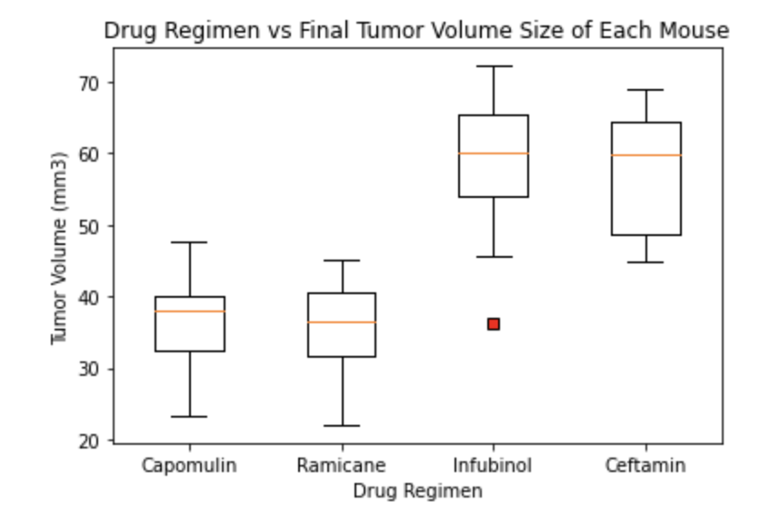

# Pharmaceutical-Analysis
Python, Pandas, Graphing and Charts for an Analysis of some Pharmaceutical regimens used on mice.
### Setup

1. Created a directory for the Challenge. Used this folder for the challenge: **Pymaceuticals** 

2. Added the Jupyter notebook: 'pharmaceuticals.ipynb' to this folder. This will be the main script to run the analysis.

3. Added the **data** directory inside 'Pymaceuticals' and stored the 'Mouse_metadat.csv' and 'Study_results.csv'

4. Added the analysis to the bottom of the 'pharmaceuticals.ipynb' workbook.

## Tasks

* Checked the data for any mouse ID with duplicate time points and remove any data associated with that mouse ID.

* Used the cleaned data for the remaining steps.

* Generated a 'summary statistics' table consisting of the mean, median, variance, standard deviation, and SEM of the tumor volume for each drug regimen using two different methods.

* Generated a bar plot using both Pandas's `DataFrame.plot()` and Matplotlib's `pyplot` that shows the total number of timepoints for all mice tested for each drug regimen throughout the course of the study.

* Generated a pie plot using both Pandas's `DataFrame.plot()` and Matplotlib's `pyplot` that shows the distribution of female or male mice in the study.

* Calculated the final tumor volume of each mouse across four of the most promising treatment regimens: Capomulin, Ramicane, Infubinol, and Ceftamin. Calculated the quartiles and IQR and quantitatively determined if there are any potential outliers across all four treatment regimens.

* Used Matplotlib, generated a box and whisker plot of the final tumor volume for all four treatment regimens and highlighted any potential outliers in the plot by changing their color and style.

* Selected a mouse that was treated with Capomulin and generated a line plot of tumor volume vs. time point for that mouse.

* Generated a scatter plot of tumor volume versus mouse weight for the Capomulin treatment regimen.

* Calculated the correlation coefficient and linear regression model between mouse weight and average tumor volume for the Capomulin treatment. Plotted the linear regression model on top of the previous scatter plot.

* Looked across all previously generated figures and tables and wrote observations or inferences that could be made from the data. Included these observations at the top of notebook.

